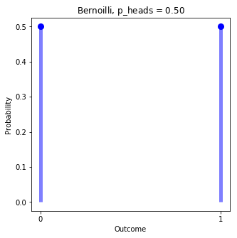
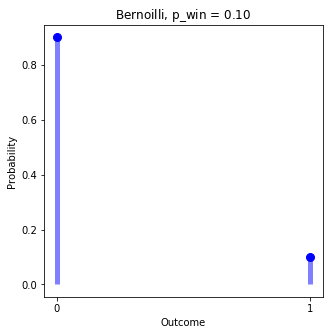
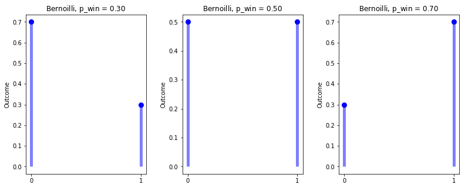
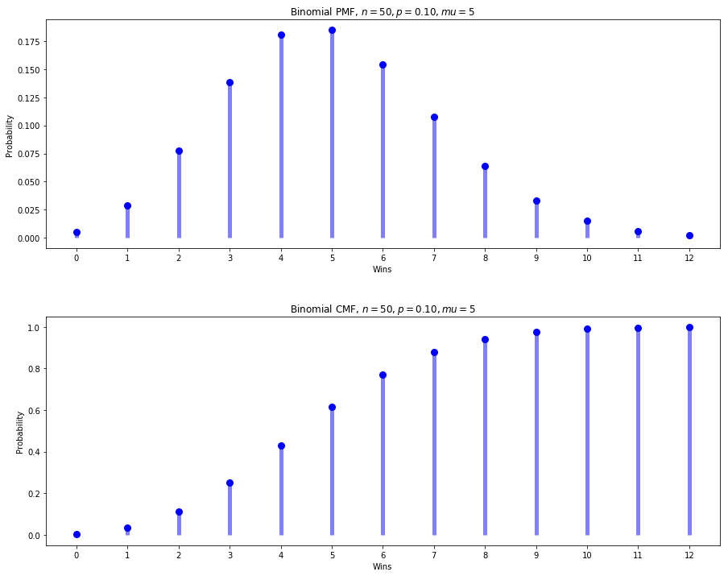
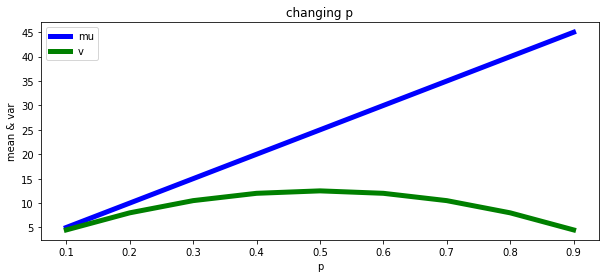
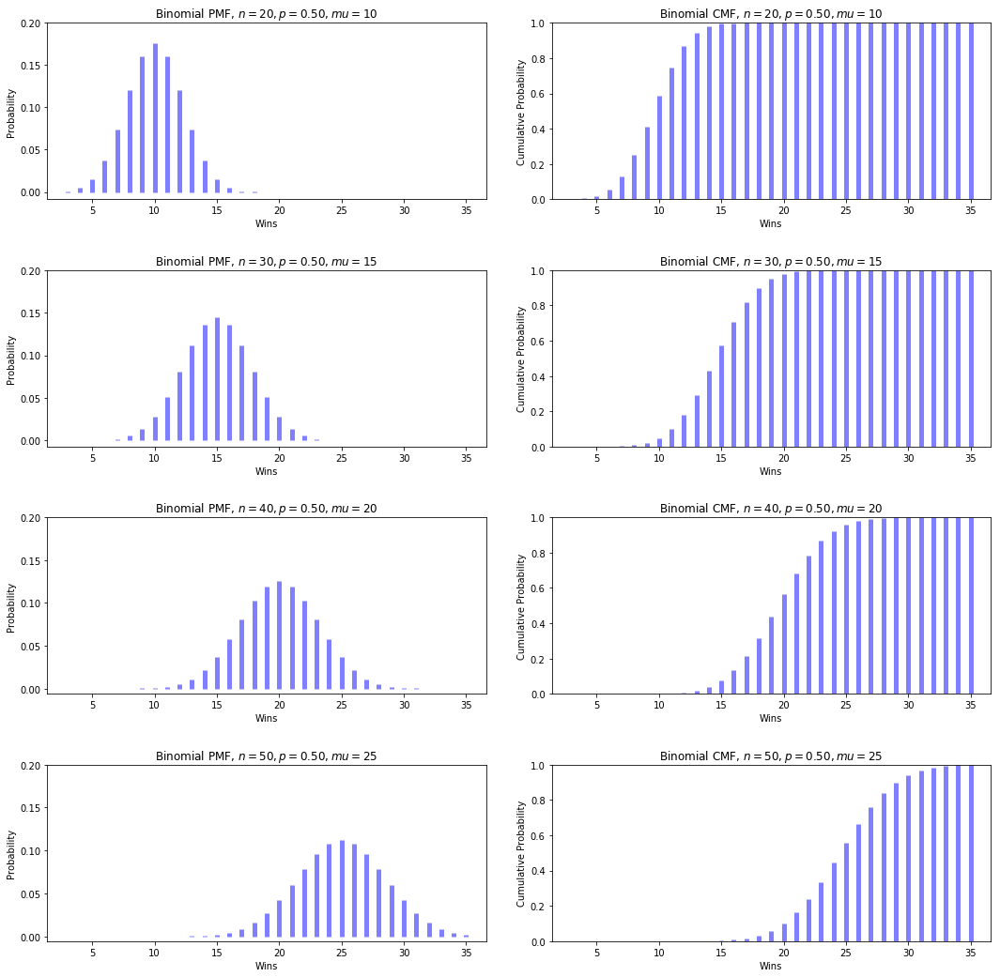
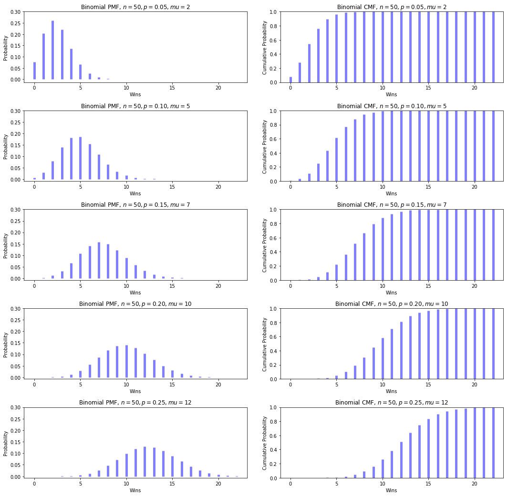
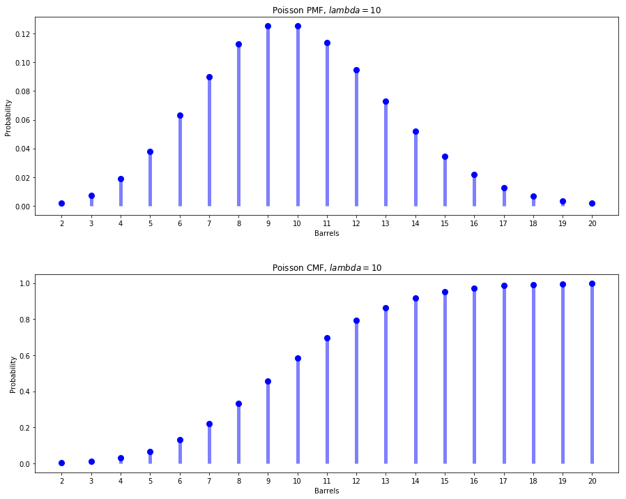
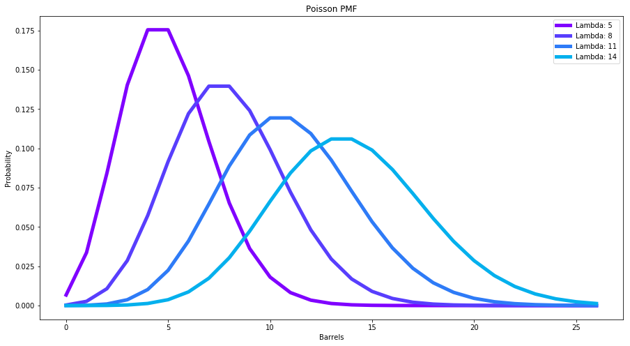
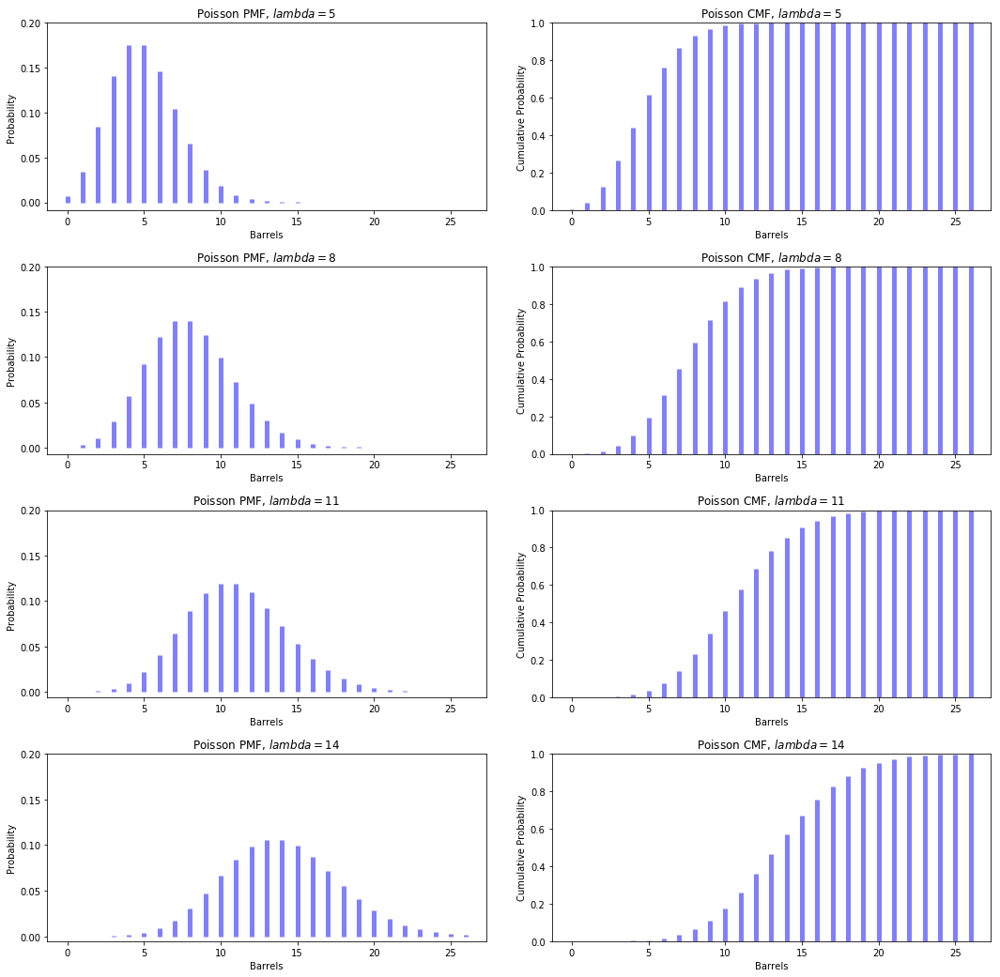

# Statistics

- [Statistics](#statistics)
- [About_Distributions](#about_distributions)
- [Bernoulli_Distribution](#bernoulli_distribution)
- [Binomial_Distribution](#binomial_distribution)
- [Poisson_Distribution](#poisson_distribution)
- [Other_Important_Distributions](#other_important_distributions)

## Statistics

### Standard (FINISH)
By the end of this unit, you will:
* **Understand** probability distributions and why we use them.
* **Describe** common distributions, their parameters and when to use them.
* **Describe** the normal distribution and its parameters of mean and standard deviation.
* **Calculate** standard deviation and variance for the normal distribution.
* **Sample** points of data from an underlying population and calculate their statistical measurement of central tendency and dispersion.
* **Estimate** population parameters of an underlying population from
* **Apply** the central limit theorem to estimate population parameters from sample statistics.

## About_Distributions

### What is a distribution and why do we use them

Data naturally occurs in distributions centered around its mean.  Probability distributions are a mathematical representation of naturally occurring data.  We will discuss some distributions in this section that are commonly used to represent data in specific circumstances. Modeling our data using a probability distribution helps understand the nature of the data and estimate its parameters.  

### Distribution parameters and how to interpret them

* **Expectation** (or **Mean**) characterizes the location of a distribution
* **Variance** or **Standard Deviation** (square root of the variance) characterizes the spread of a distribution
* **Skewness** characterizes the asymmetry of a distribution
* **Kurtosis** characterizes the heavy-tailedness of a distribution (i.e., how ofter extreme outlier events occur under the distribution.

**Images to describe each**

### Continuous vs Discrete
There are two types of probability distributions:

**Discrete distributions** define positive probabilities for specific outcomes x of a discrete-valued random variable X that are defined using a **probability mass function (PMF)**, i.e.,

$Pr(X=x)$

**Image Example using Binomial**

**Continuous distributions** on the other hand (perhaps unexpectedly and paradoxically) define $Pr(X=x)=0$ for every potential outcome x of a *continuous-valued random variable* X but define positive probabilities for  range of x values according to the area under the **probability density function (PDF)** over the set E, i.e.,

$$Pr(X=x∈E)=∫Ef(X=x)dx$$

**Image example using Normal**

**identically and independently distributed**

For more explanation, see [this video about PDFs from Khan Academy](https://www.khanacademy.org/math/statistics-probability/random-variables-stats-library/random-variables-continuous/v/probability-density-functions).


### PMF and PDF vs CMF vs CDF


Images from Binomial and Normal


### Challenge


## Bernoulli_Distribution
### What is the Bernoulli distribution

The **Bernoulli distribution** is a *discrete probability distribution* modeling a one chance attempt that results in either a success of a failure. Such an attempt is called a **Bernoulli trial**, with a success typically recorded as a 1 and a failure typically recorded as a 0.

The most commonly cited example of a Bernoulli trial is getting a heads on a coin flip, where the chance of getting a heads is 50% if the coin is fair.



### Probability Mass Function (PMF) and Parameters

$Pr(X=1)=p$, and $Pr(X=0)=1−p$

- **p** is the probability of a successful trial.

Mean: $\mu = p$
Variance: $\sigma^2 = p(1−p)$

```python
p_win = .1
p_loss = 1 - p_win

pw = s.bernoulli.pmf(k=1, p=p_win)
pl = s.bernoulli.pmf(k=0, p=p_win)
print("Probability of a win: {:0.2f}, Probability of a loss: {:0.2f}".format(pw, pl))

# Plot Bernoulli Distribution

# Create x values
x = np.arange(0, 2)

# Create Plot
fig, ax = plt.subplots(1, 1, figsize=(5, 5))

# Add Dots
ax.plot(x, s.bernoulli.pmf(k=x, p=p_win), 'bo', ms=8, label='binomial pmf')

# Add Vertical lines
ax.vlines(x, 0, s.bernoulli.pmf(k=x, p=p_win), colors='b', lw=5, alpha=0.5)

# Format Axes
ax.set_ylabel('Probability')
ax.set_ylabel('Outcome')
ax.set_xticks(x)

# Set Title
ax.set_title("Bernoilli, p_wins = ${:0.2f}$".format(p_win));
```
```
>>> Probability of a win: 0.10, Probability of a loss: 0.90
```


### Parameters of the Bernoulli distribution
- **p** is the probability of a successful trial.

### Demonstrate how p changes the distribution
```python
# Create x values
x = np.arange(0, 2)

# Set ps
ps = np.arange(.3, .8, .2)

# Create Plot
fig = plt.figure(figsize=(18, 5))
plot = 1
for p in ps:
    # Add Dots
    ax = fig.add_subplot(1,4,plot)
    ax.plot(x, s.bernoulli.pmf(k=x, p=p), 'bo', ms=8, label='bernoulli pmf')

    # Add Vertical lines
    ax.vlines(x, 0, s.bernoulli.pmf(k=x, p=p), colors='b', lw=5, alpha=0.5)

    # Format Axes
    ax.set_ylabel('Probability')
    ax.set_ylabel('Outcome')
    ax.set_xticks(x)

    # Set Title
    ax.set_title("Bernoilli, p_win = ${:0.2f}$".format(p))
    plot += 1

plt.subplots_adjust(wspace=0.3,hspace=.4);
```


### Challenge


## Binomial Distribution
### What is the Binomial distribution
The **binomial distribution** is a *discrete probability distribution* that defines the probability of observing exactly *k* successes out of *n* identical Bernoulli trials.  



### Probability Mass Function (PMF) and Parameters

$Pr(X=k)=(\frac{n!}{k!(n-k)!})p^k(1−p)^{n−k}$

- **p** is the probability of a successful trial.
- **n** is the number of trials.

Mean: $\mu = np$
Variance: $\sigma^2 = np(1-p)$

As **n**, the number of trials, increases $\mu$ and $\sigma^2$ also increase.  However, **p**, the probability of a successful trial, is bound between 0 and 1,  As it increases $\mu$ increases but $\sigma^2$ reaches a maximum at 0.5.




### Demonstrate how n changes the distribution
```python
# Changing n

# set p
p = .5
mu = n*p

# Plot Binomial Distribution PMF

# ns
ns = np.arange(20, 60, 10)

# Find min and max x and y values for plots
min_x = p*n
max_x = p*n
max_y = 0
for n in ns:
    min_x_test = s.binom.ppf(.001, n, p)
    max_x_test = s.binom.ppf(.999, n, p)
    if min_x_test < min_x:
        min_x = min_x_test
    if max_x_test > max_x:
        max_x = max_x_test

    max_y_test = np.max(s.binom.pmf(x, n, p))
    if max_y_test > max_y:
        max_y = max_y_test

max_y = myround(max_y, 5) + .01

# Create x values
x = np.arange(min_x, max_x, 1)

# Create Plot
fig = plt.figure(figsize=(18, 18))

plot = 1

for n in ns:
    # Add PMFs
    ax = fig.add_subplot(len(ns),2, plot)
    ax.vlines(x, 0, s.binom.pmf(x, n, p), colors='b', lw=5, alpha=0.5)
    ax.set_yticks(np.arange(0, max_y, 0.05))
    ax.set_ylabel("Probability")
    ax.set_xlabel("Wins")
    ax.set_title("Binomial PMF, $n={}, p = {:0.2f}, mu = {}$".format(n, p, int(n*p)))

    # Add CMFs
    plot += 1
    ax = fig.add_subplot(len(ns),2, plot)
    ax.vlines(x, 0, s.binom.cdf(x, n, p), colors='b', lw=5, alpha=0.5)
    ax.set_ylim(0,1)
    ax.set_ylabel("Cumulative Probability")
    ax.set_xlabel("Wins")
    ax.set_title("Binomial CMF, $n={}, p = {:0.2f}, mu = {}$".format(n, p, int(n*p)))

    plot += 1


plt.subplots_adjust(wspace=0.15,hspace=.4);
```



### Demonstrate how p changes the distribution
```python
# Changing p
# Plot Binomial Distribution PMF

# set n
n = 50

# ps
ps = np.arange(.05, .3, .05)

# Find min and max x and y values for plots
min_x = p*n
max_x = p*n
max_y = 0
for p in ps:
    min_x_test = s.binom.ppf(.001, n, p)
    max_x_test = s.binom.ppf(.999, n, p)
    if min_x_test < min_x:
        min_x = min_x_test
    if max_x_test > max_x:
        max_x = max_x_test

    max_y_test = np.max(s.binom.pmf(x, n, p))
    if max_y_test > max_y:
        max_y = max_y_test

max_y = myround(max_y, 5) + .01

# Create x values
x = np.arange(min_x, max_x, 1)

# Create Plot
fig = plt.figure(figsize=(18, 18))

plot = 1

for p in ps:
    # Add PMFs
    ax = fig.add_subplot(len(ps),2, plot)
    ax.vlines(x, 0, s.binom.pmf(x, n, p), colors='b', lw=5, alpha=0.5)
    ax.set_yticks(np.arange(0, max_y, 0.05))
    ax.set_ylabel("Probability")
    ax.set_xlabel("Wins")
    ax.set_title("Binomial PMF, $n={}, p = {:0.2f}, mu = {}$".format(n, p, int(n*p)))

    # Add CMFs
    plot += 1
    ax = fig.add_subplot(len(ps),2, plot)
    ax.vlines(x, 0, s.binom.cdf(x, n, p), colors='b', lw=5, alpha=0.5)
    ax.set_ylim(0,1)
    ax.set_ylabel("Cumulative Probability")
    ax.set_xlabel("Wins")
    ax.set_title("Binomial CMF, $n={}, p = {:0.2f}, mu = {}$".format(n, p, int(n*p)))

    plot += 1


plt.subplots_adjust(wspace=0.15,hspace=.4);
```



### Challenge


## Poisson_Distribution
### What is the Poisson distribution
The **Poisson distribution** is a *discrete probability distribution* that is useful for modeling the probability of a number of events occurring over a time interval.  If you ever see a rate you should immediately jump to Poisson.



### Probability Mass Function (PMF) and Parameters
$Pr(X=k) = \frac{\lambda^k * e^{−\lambda}}{k!}$

- In the Poisson Distribution $\lambda$ is the expected value of events in the given time interval.  It turns out that the $E[X] = \lambda = \sigma^2$.  
- Since, that is true then as $\lambda$ increases $\sigma^2$ also increases.

### Demonstrate how lambda changes the distribution
```python
# Changing Lambda
# Plot Poisson Distribution PMF

# Lambdas
lams = np.arange(5, 15, 3)

# Create x values
min_x = lam
max_x = lam
for lam in lams:
    min_x_test = s.poisson.ppf(.001, lam)
    max_x_test = s.poisson.ppf(.999, lam)
    if min_x_test < min_x:
        min_x = min_x_test
    if max_x_test > max_x:
        max_x = max_x_test

x = np.arange(min_x, max_x, 1)

# Create Plot
fig, ax = plt.subplots(1, 1, figsize=(15, 8))

color=iter(cm.rainbow(np.linspace(0,1,n)))

for i in range(len(lams)):
    line = ax.plot(x, s.poisson.pmf(k=x, mu=lams[i]), color=next(color), lw=5, ms=8, label="Lambda: {}".format(lams[i]))
    next(color)
    next(color)
    next(color)

ax.set_ylabel("Probability")
ax.set_xlabel("Barrels")
ax.legend()
ax.set_title("Poisson PMF");
```


```python
# Changing Lambda
# Plot Poisson Distribution PMF

# Lambdas
lams = np.arange(5, 15, 3)

# Create x values
min_x = lam
max_x = lam
for lam in lams:
    min_x_test = s.poisson.ppf(.001, lam)
    max_x_test = s.poisson.ppf(.999, lam)
    if min_x_test < min_x:
        min_x = min_x_test
    if max_x_test > max_x:
        max_x = max_x_test

x = np.arange(min_x, max_x, 1)

# find max y value
max_y = 0
for lam in lams:
    max_y_test = np.max(s.poisson.pmf(k=x, mu=lam))
    if max_y_test > max_y:
        max_y = max_y_test
max_y = myround(max_y, 5) + .01

# Create Plot
fig = plt.figure(figsize=(18, 18))

plot = 1

for lam in lams:
    # Add PMFs
    ax = fig.add_subplot(len(lams),2, plot)
    ax.vlines(x, 0, s.poisson.pmf(k=x, mu=lam), colors='b', lw=5, alpha=0.5)
    ax.set_yticks(np.arange(0, max_y, 0.05))
    ax.set_ylabel("Probability")
    ax.set_xlabel("Barrels")
    ax.set_title("Poisson PMF, $lambda={0}$".format(lam))

    # Add CMFs
    plot += 1
    ax = fig.add_subplot(len(lams),2, plot)
    ax.vlines(x, 0, s.poisson.cdf(k=x, mu=lam), colors='b', lw=5, alpha=0.5)
    ax.set_ylim(0,1)
    ax.set_ylabel("Cumulative Probability")
    ax.set_xlabel("Barrels")
    ax.set_title("Poisson CMF, $lambda={0}$".format(lam))

    plot += 1


plt.subplots_adjust(wspace=0.15,hspace=.3);
```


### Challenge

## Other_Important_Distributions
### Geometric
The **geometric distribution** is a *discrete probability distribution* which models the probability of the k unsuccessful Bernoulli trial until the first success.

PMF: $P(X=k) = (1−p)^{k−1} p$

Mean: $\mu = \frac{1}{p}$

Variance: $\sigma^2 = \frac{1−p}{p^2}$

PDF
CDF

### Uniform
The **uniform distribution** is a *continuous probability distribution* which models the probability over a defined space where each outcome within that space has an equal probability.

PMF: $f(X = x) = \frac{1}{b-a}$, when x in $[a, b]$ and 0 otherwise

Mean: $\mu = \frac{a+b}{2}$

Variance: $\sigma^2 = \frac{(b-a)^2}{2}$

PDF
CDF

### Exponential
The **exponential distribution** is a *continuous probability distribution* that has proven to be a useful model for the distribution of “time to arrival” outcomes.  Using this distribution the probability of how long until a success can be found.

PMF: $Pr(X=x)=\lambda e^{−\lambda x}$

Mean: $\mu = \frac{1}{\lambda}$

Variance: $\sigma^2 = \frac{1}{\lambda^2}$

PDF
CDF

### Challenge (these could be easy, like “what distribution is this? When is it used?”)
